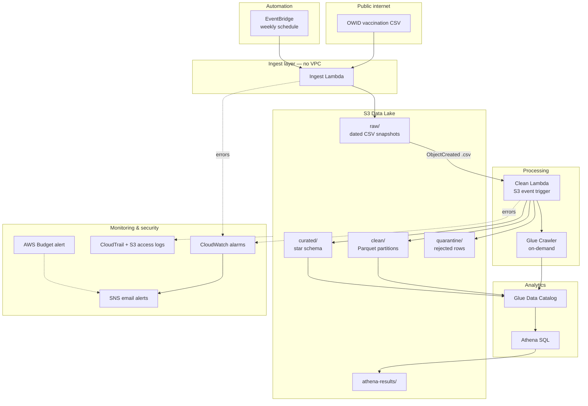
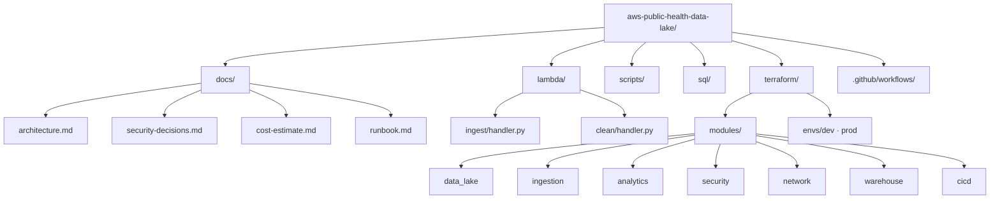
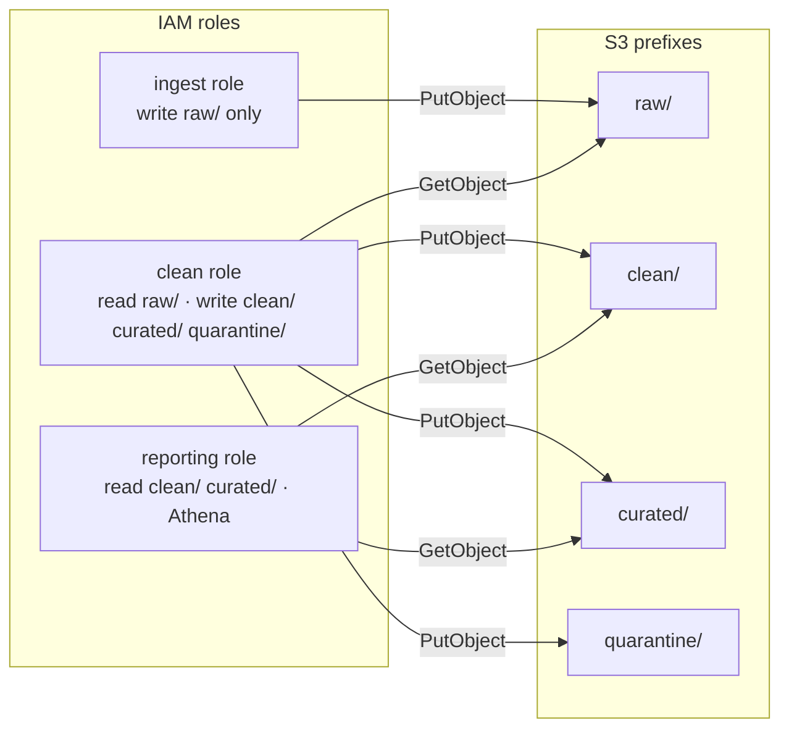

# Project Workflow & Planning Diagrams

> **UML diagrams (Use Case, Sequence, Class, Component, Deployment, Activity, State, Gantt):**  
> See **[docs/diagrams/](diagrams/)** — PlantUML source files you can export to PNG/SVG.

## 1. Runtime data pipeline (AWS)

What the system does once deployed:

---

## 2. Fourteen-day GitHub push workflow

How you build and push the repo (no AWS required until after Day 14):

```mermaid
flowchart LR
    subgraph W1["Week 1 — Code & docs"]
        D1["Day 1<br/>README · gitignore · checkov"]
        D2["Day 2<br/>architecture · security docs"]
        D3["Day 3<br/>cost · runbook"]
        D4["Day 4<br/>bootstrap scripts"]
        D5["Day 5<br/>ingest Lambda"]
        D6["Day 6<br/>clean Lambda"]
        D7["Day 7<br/>helper scripts"]
        D8["Day 8<br/>Athena SQL"]
    end

    subgraph W2["Week 2 — Terraform & CI"]
        D9["Day 9<br/>S3 data lake module"]
        D10["Day 10<br/>ingestion module"]
        D11["Day 11<br/>analytics module"]
        D12["Day 12<br/>security module"]
        D13["Day 13<br/>dev env + VPC/RDS"]
        D14["Day 14<br/>CI/CD · prod · polish"]
    end

    subgraph After["After Day 14"]
        AWS["Create AWS account"]
        DEPLOY["terraform apply"]
        PROVE["Athena query + IAM tests"]
    end

    D1 --> D2 --> D3 --> D4 --> D5 --> D6 --> D7 --> D8
    D8 --> D9 --> D10 --> D11 --> D12 --> D13 --> D14
    D14 --> AWS --> DEPLOY --> PROVE
```

---

## 3. Repository structure (target end state)

---

## 4. IAM roles and S3 zones

---

## Viewing these diagrams

- **GitHub:** Mermaid renders automatically in markdown on github.com
- **VS Code:** Install "Markdown Preview Mermaid Support"
- **Export PNG:** Paste into [mermaid.live](https://mermaid.live) → Export
